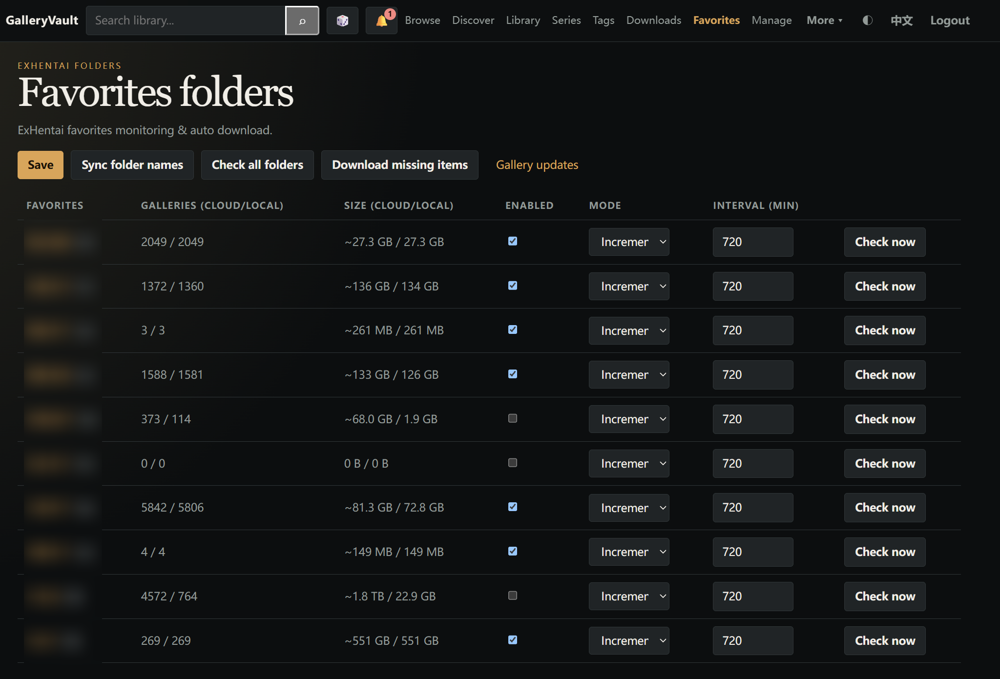
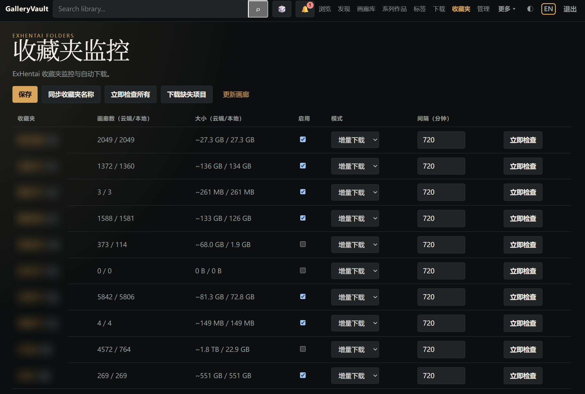
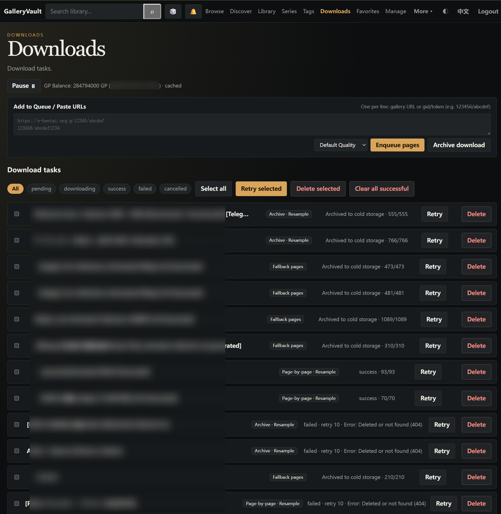
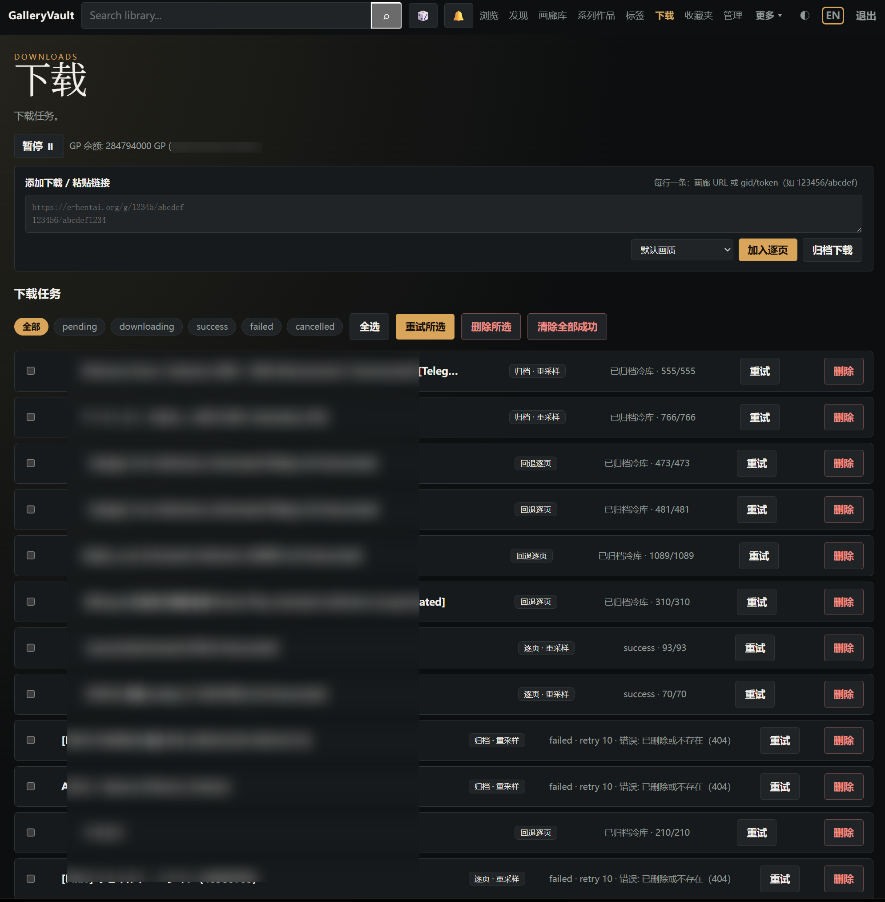
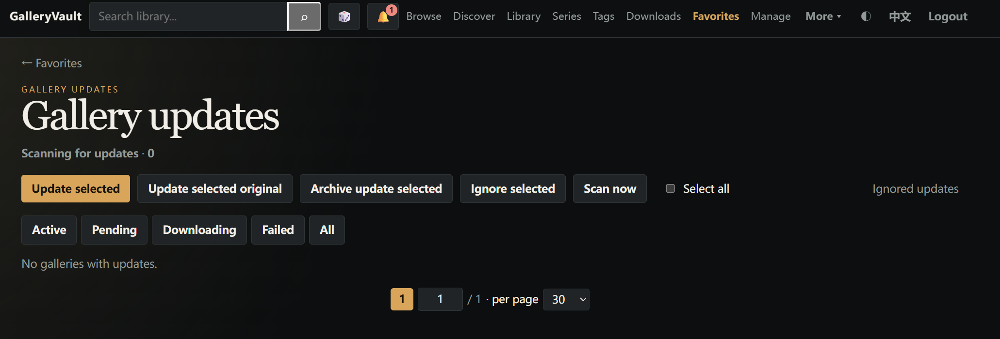
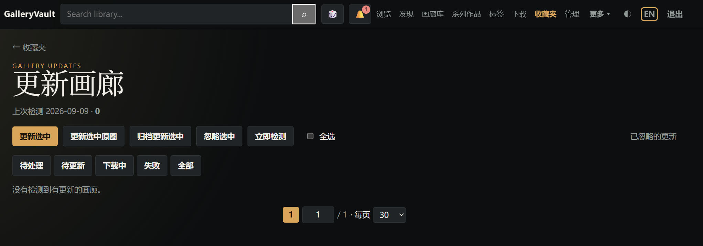

# GalleryVault

<p align="center">
  
</p>

<p align="center">
  <strong>Modern Self-Hosted Gallery Asset Management & Cloud Synchronization Hub</strong><br>
  Local Media Archiving · Deep Metadata Sync · Full Lifecycle Tracking · Native Encryption at Rest · Immersive Reader
</p>

<p align="center">
  <a href="https://github.com/ResidualBlood/galleryvault/actions/workflows/ci-backend.yml"></a>
  <a href="https://github.com/ResidualBlood/galleryvault/actions/workflows/ci-frontend.yml"></a>
  <a href="https://hub.docker.com/u/residualblood"></a>
  <a href="https://github.com/ResidualBlood/galleryvault/wiki"></a>
  <a href="https://github.com/ResidualBlood/galleryvault/blob/main/LICENSE"></a>
</p>

<p align="center">
  <a href="README.md">中文</a> · <strong>English</strong> · <a href="https://github.com/ResidualBlood/galleryvault/wiki/Home-EN">📖 Online Documentation</a>
</p>

---

GalleryVault is a **private, self-hosted local gallery asset management system** built for personal digital collections. Your media files, index databases, and collection relationships remain entirely on your own hardware or private NAS, free from reliance on external hosted services.

It natively indexes Ehviewer export directories, CBZ/CBR archives, and raw image folders into a high-fidelity, searchable PostgreSQL index. It provides bi-directional cloud metadata synchronization, favorite folder monitoring, re-upload version tracking, and cross-GID deduplication. Built-in readers support Japanese RTL manga, dual-page layout, vertical webtoon streaming, and animated slideshows with native frame delay adaptation, alongside an open OPDS protocol catalog and optional AES-256-GCM encryption at rest.

## Why GalleryVault?

Unlike generic comic servers or simple extraction utilities, GalleryVault is engineered specifically around the complete lifecycle and rich metadata dynamics of gallery archives:

- ⚡ **Native Ehviewer Compatibility & Zero Migration Overhead**: Directly mount Ehviewer multi-tier export folders without unzipping, renaming, or rearranging files. It seamlessly parses SpiderInfo (V1/V2) and Sidecar metadata files on ingestion.
- 🔄 **Deep Cloud Metadata Integration**: Automatically fetch categories, multi-language tags, and posting metadata. Supports bi-directional synchronization between local disks and remote favorites, incremental background monitoring, and cloud-deletion safeguards.
- 🎯 **Lifecycle Version Tracking & Intelligent Deduplication**: First-class tracking for re-uploaded works (detecting newly assigned GIDs) with one-click in-place upgrades. Built-in cross-GID clustering and duplicate audits eliminate redundant translations and copycat uploads.
- 🛡️ **Fine-Grained Concurrency & Self-Healing Watchdogs**: Features task-level exponential backoff retries, per-page concurrency controls, resumable official archive stream downloads (reusing existing tokens without extra quota charges), and slow H@H node / 302 challenge probe watchdogs.
- 🔒 **Enterprise-Grade Privacy & Encryption at Rest**: Optional AES-256-GCM field-level database encryption (`ENCRYPTION_KEY`) ensures sensitive tokens and credentials are encrypted at rest, combined with 10-year persistent signed sessions and immediate revocation upon password changes.
- 📖 **Immersive Reading & Ecosystem Interoperability**: Multiple reading layouts (RTL, LTR, Webtoon, dual-page) and animation-aware slideshows for GIF/WebP. Exposes a standard OPDS feed to serve third-party mobile reader clients.

---

## Core Feature Matrix

### 1. Local Asset Archiving & High-Fidelity Parsing
- **Zero-Friction Ingestion**: Scans `<gid>-<title>/` folders, automatically recognizing `.ehviewer` files, JHenTai `metadata` JSON files, and standard CBZ/CBR packages (with `ComicInfo.xml`).
- **Tiered Cold/Hot Storage**: Supports mounting active download workspaces alongside cold archive volumes (CBZ or read-only pools) with standardized `.galleryvault.json` sidecar files.
- **Resilient Archive Extraction**: Gracefully inspects 7z and PDF formats, extracting image streams on demand without leaving residual temp files on the host.

### 2. Cloud Synchronization & Favorites Monitoring
- **Batch Metadata Backfilling**: Efficiently queries categories, ratings, and tag namespaces with batch caching, preheating thumbnail caches on disk.
- **Multi-Folder Folder Monitoring**: Monitors up to 10 independent favorite folders with configurable sync modes (incremental download, watch-only, scheduled polling).
- **Update Tracking**: Continuously monitors re-upload listings, identifies updated versions with newly assigned GIDs, and provides one-click replacements of obsolete local archives.
- **Cross-GID Duplicate Auditing**: Analyzes archive clusters to surface duplicate releases, language variations, and redundant local copies for fast deduplication.

### 3. Resilient Download Pipeline
- **Dual-Engine Architecture**: Supports concurrent page-by-page streaming as well as official whole-gallery archive (zip) downloads with Range resume capabilities.
- **Self-Healing & Watchdogs**: Automatically retries transient network interruptions with exponential backoff (30s to 6h, up to 10 attempts); built-in timeouts drop stalling transfer nodes.
- **Anti-Abuse Protections**: Detects 302 temporary challenge responses, auto-pauses the download queue to safeguard credentials, and polls background probes to safely resume.
- **Instant Ingestion**: Downloaded items are ingested into the database index immediately upon completion without requiring full-library rescans.

### 4. Reading Experience & Open Integration
- **Adaptive Layouts**: Full support for Right-to-Left (Japanese manga), Left-to-Right, continuous vertical webtoon cascade, and dual-page split modes.
- **Frame-Rate Adaptive Slideshow**: Reads frame durations from animated GIF and WebP assets to pace slideshows naturally to the artwork's native timing.
- **Multi-Dimensional Tag Search**: Integrated with the EhTagTranslation database; supports complex AND/OR tag queries, Chinese reverse-lookup, and exclusion filters (`-tag`).
- **Standard OPDS Server**: Serves a compliant OPDS catalog (`GET /api/opds`) with HTTP Basic authentication to integrate directly into Tachiyomi, Mihon, and Panels.

---

## Quick Start

Launch the full stack in one minute using Docker Compose:

```bash
mkdir galleryvault && cd galleryvault
curl -fsSL https://raw.githubusercontent.com/ResidualBlood/galleryvault/main/docker-compose.yml -o docker-compose.yml
docker compose up -d
```

### 1. Access & Initial Setup
- Open your browser and navigate to **`http://<host-ip>:8000`** (backend JSON API is on port `:8001`).
- Log in using the default credentials: password **`p1a2s3s4`**.
- **Security Notice**: Immediately navigate to *Settings* and change the administrator password.

### 2. Volume Mount Overview

| Local Path | Container Path | Purpose |
| :--- | :--- | :--- |
| `./db-data` | `/var/lib/postgresql/data` | PostgreSQL database files (indexes, settings, histories); preserved across updates |
| `./library` | `/library` | Main library root for existing archives (Ehviewer folders, CBZ/CBR); downloads are not saved here |
| `./downloads` | `/downloads` | Target directory for active downloads; automatically indexed into the library |
| `./cache` | `/gv-cache` | Local thumbnail and cover cache; prevents redundant bandwidth consumption |
| `./Archive` | `/archive` | (Optional) Tiered cold storage destination; supports mounting multiple storage volumes |

### 3. Key Environment Variables

Configure advanced options in your `docker-compose.yml`:

- `ENCRYPTION_KEY`: A 32-byte hex-encoded key for AES-256-GCM database encryption at rest. Encrypts session keys, cookies, and tokens.
- `AUTH_SECRET`: Secret key used for signing session cookies. Automatically generated and persisted into the database if omitted.
- `PUID` / `PGID`: Set unprivileged user and group IDs (e.g. `1000:1000`) to avoid host file ownership conflicts on NAS environments.
- `TRUSTED_PROXIES`: Comma-separated list of trusted reverse proxy IPs or CIDR blocks (e.g. `127.0.0.1,192.168.1.0/24`) for rate limiting accuracy.

---

## Screenshot Gallery

> Note: Screenshots and illustrations are sanitized for public hosting compliance.

| Section | English UI | Chinese UI |
| :--- | :--- | :--- |
| **Gallery Library** |  |  |
| **Tag Cloud** |  |  |
| **Favorites Dedupe** |  |  |
| **Favorites Monitor** |  |  |
| **Download Queue** |  |  |
| **Updates Tracker** |  |  |

---

## Ecosystem & Client Compatibility

| Category | Client / Tool | Integration Details |
| :--- | :--- | :--- |
| **Ehviewer Ecosystem** | Ehviewer_CN_SXJ, FooIbar, Overhauled, NekoWhite, MHViewer, Apple, OHOS | Natively recognizes `<gid>-<title>/` folder structures and SpiderInfo V1/V2 metadata |
| **Cross-Platform** | JHenTai (Flutter Multi-platform) | Automatically reads `metadata` JSON files and restores gallery identity |
| **Mobile Readers** | Tachiyomi, Mihon, Panels, Komikku | Connects seamlessly via the built-in OPDS catalog (`GET /api/opds`) |
| **Standard Archives** | CBZ, CBR, 7z, PDF | Indexes archives with embedded `ComicInfo.xml` or clean folder image files |

---

## Documentation Links

For comprehensive deployment and usage guides, visit the **[GitHub Wiki](https://github.com/ResidualBlood/galleryvault/wiki/Home-EN)**:

- **[Usage Guide](https://github.com/ResidualBlood/galleryvault/wiki/Usage-EN)** — Searching, reader controls, download queuing, and deduplication workflows
- **[Features](https://github.com/ResidualBlood/galleryvault/wiki/Features-EN)** — In-depth architectural details and feature breakdowns
- **[Deployment](https://github.com/ResidualBlood/galleryvault/wiki/Deployment-EN)** — Nginx / Caddy reverse proxies, TLS hardening, user permissions, and tiered storage
- **[Encryption at Rest](https://github.com/ResidualBlood/galleryvault/wiki/Encryption-EN)** — AES-256-GCM field encryption, key migration, and emergency recovery
- **[FAQ](https://github.com/ResidualBlood/galleryvault/wiki/FAQ-EN)** — Common questions, networking watchdogs, tag translations, and sessions

---

## Tooling & Operations

The `scripts/` directory includes built-in operational utilities:

- **`scripts/monitor_prod_logs.sh`**: Streams live logs across production containers and packages them into a local archive.
- **`scripts/analyze_prod_logs.py`**: Diagnoses production log archives, aggregating error traces, HTTP status distributions, and performance bottlenecks.

---

## Acknowledgements

- **Ehviewer_CN_SXJ**: Directory conventions and multi-tier metadata reference.
- **EhTagTranslation**: Comprehensive multi-language tag translation database and sync tools.
- **ehsyringe**: Translation format structuring and data aggregation.

---

## Disclaimer

GalleryVault is an open-source local media asset management and metadata organization utility. Features involving synchronization with third-party cloud services require user-provided credentials. Users are responsible for complying with applicable local laws and the terms of service of third-party platforms.
