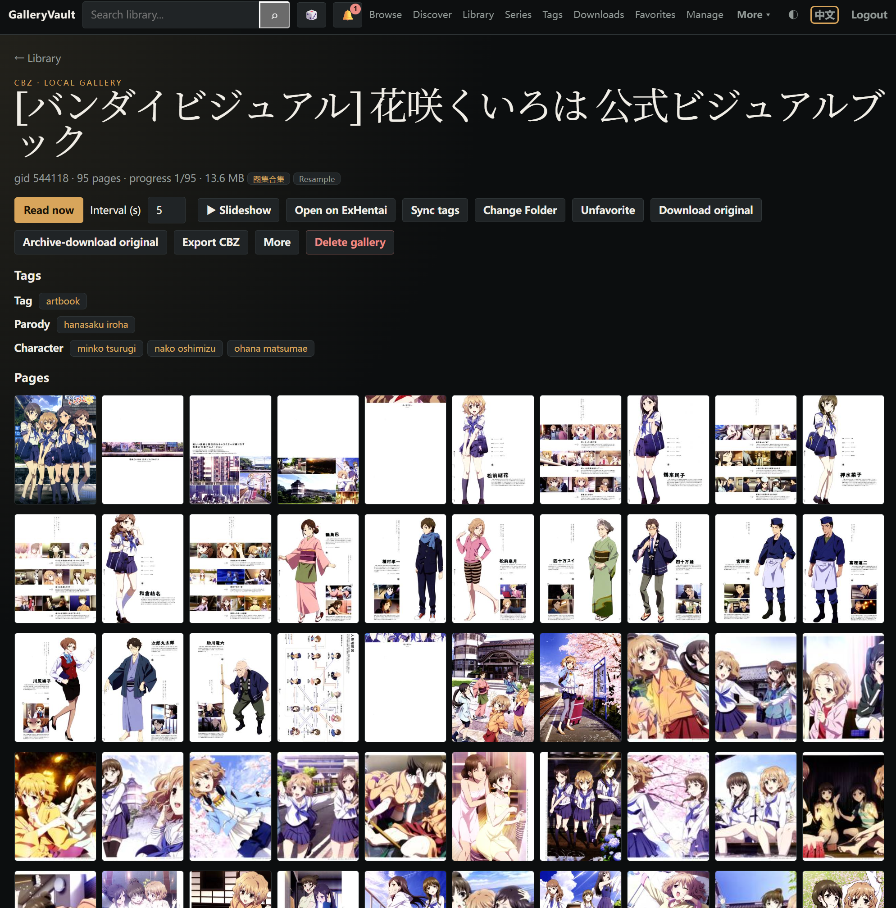

# GalleryVault

<p align="center">
  
</p>

<p align="center">
  <strong>Self-hosted gallery library · built for Ehviewer export trees</strong><br>
  Index <code>&lt;gid&gt;-title/</code> folders and CBZ as-is · optional E-Hentai / ExHentai favorites sync · files stay on your machine
</p>

<p align="center">
  <a href="https://github.com/ResidualBlood/galleryvault/actions/workflows/ci-backend.yml"></a>
  <a href="https://github.com/ResidualBlood/galleryvault/actions/workflows/ci-frontend.yml"></a>
  <a href="https://hub.docker.com/u/residualblood"></a>
  <a href="https://github.com/ResidualBlood/galleryvault/wiki/Home-EN"></a>
  <a href="https://github.com/ResidualBlood/galleryvault/blob/main/LICENSE"></a>
</p>

<p align="center">
  <a href="README.md">中文</a> · <strong>English</strong> · <a href="https://github.com/ResidualBlood/galleryvault/wiki/Home-EN">Wiki</a>
</p>

Mount Ehviewer export folders and read SpiderInfo as-is. **No cookies → local library.** Cookies unlock Discover, ten favorite folders, and downloads.

## Highlights

- **Ingest without renaming** — native `<gid>-title/` trees, `.ehviewer` (SpiderInfo V1/V2), JHenTai `metadata`, CBZ/CBR, 7z (images only), PDF. Downloads land in `downloads/`, never in library.
- **Favorites as a private cloud** — watch ten folders (incremental download or watch-only); Discover Popular / Watched / Toplist; GID replacements in one click.
- **Library hygiene** — same-GID copies, favorite dupes, cross-GID clusters (alt translations / quality), series grouping, missing-page integrity, multi-disk cold CBZ.
- **Reader for doujin / manga** — RTL / dual-page / webtoon; slideshow follows GIF/WebP frame duration. OPDS for Tachiyomi / Mihon; optional Telegram bot (paste a URL to enqueue).
- **Secrets at rest** — with `ENCRYPTION_KEY`, cookies / bot token / password hashes use AES-256-GCM. Changing the password revokes every session.

<p align="center">
  
  
  
</p>

More shots: [Wiki · Screenshots](https://github.com/ResidualBlood/galleryvault/wiki/Screenshots-EN). Routes: [Usage](https://github.com/ResidualBlood/galleryvault/wiki/Usage-EN).

## Quick start

```bash
mkdir galleryvault && cd galleryvault
curl -fsSL https://raw.githubusercontent.com/ResidualBlood/galleryvault/main/docker-compose.yml -o docker-compose.yml
docker compose up -d
```

1. Open `http://<host-ip>:8000` (API binds `127.0.0.1:8001` only, proxied by the frontend).
2. Default password **`p1a2s3s4`**. First login goes to `#/welcome`; you must change it.
3. Put existing galleries in `./library`, then **Scan library**. Downloads land in `./downloads`, never in library.

### Volumes

| Host path | Container | Purpose |
| :--- | :--- | :--- |
| `./db-data` | `/var/lib/postgresql` | PostgreSQL 18 (UID 999 — do not chown to yourself. **Do not use `/var/lib/postgresql/data`, do not set `PGDATA`**) |
| `./library` | `/library` | Existing library; downloads never write here. Read-only mounts fail deletes and log it |
| `./downloads` | `/downloads` | New downloads, ingested immediately |
| `./cache` | `/gv-cache` | Thumbnail / cover cache |
| `./archive` | `/archive` | **Optional**; commented out in compose. Set `archive_roots` in Settings (one container path per line) |

Cold archive: uncomment `- ./archive:/archive`, save `archive_roots` in Settings, then **Manage → Cold archive** (`#/archive`). CBZ names are always `gid-english-title.cbz`. Multi-disk balancing and source purge: [Deployment](https://github.com/ResidualBlood/galleryvault/wiki/Deployment-EN).

### Environment

Set these on the backend service in `docker-compose.yml`:

- `ENCRYPTION_KEY`: any long random string (not a 32-byte hex key). Encrypts cookies / bot token / password hashes with AES-256-GCM. Losing it makes ciphertext unreadable; see [Encryption](https://github.com/ResidualBlood/galleryvault/wiki/Encryption-EN).
- `AUTH_SECRET`: session HMAC. If unset, generated on first boot and stored in the DB.
- `PUID` / `PGID`: avoid root-owned files on NAS.
- `TRUSTED_PROXIES`: proxy CIDRs, e.g. `127.0.0.1,192.168.1.0/24`.
- `POSTGRES_PASSWORD`: DB password, default `galleryvault`.

Library / download / archive paths and concurrency live in the Web UI. Connection-pool tuning: [Deployment](https://github.com/ResidualBlood/galleryvault/wiki/Deployment-EN).

## Docs

- [Usage](https://github.com/ResidualBlood/galleryvault/wiki/Usage-EN) — wizard, cookies, nav
- [Features](https://github.com/ResidualBlood/galleryvault/wiki/Features-EN) — capability matrix
- [Deployment](https://github.com/ResidualBlood/galleryvault/wiki/Deployment-EN) — mounts, Nginx/Caddy, tiered storage
- [Manage](https://github.com/ResidualBlood/galleryvault/wiki/Manage-EN) — dedupe, integrity, cold archive
- [FAQ](https://github.com/ResidualBlood/galleryvault/wiki/FAQ-EN)

Ehviewer family, JHenTai, OPDS: [Compatibility](https://github.com/ResidualBlood/galleryvault/wiki/Compatibility-EN).

## Acknowledgements

- Ehviewer_CN_SXJ — directory and SpiderInfo conventions
- EhTagTranslation — tag database
- ehsyringe — translation packaging

## Disclaimer

### 1. NSFW / 18+

This software is for organizing media on private hardware. It may be used with adult content. **Only for people of legal adult age.** If you are a minor or local law forbids it, stop using the software.

### 2. Third-party content

GalleryVault **does not host or distribute** media files. E-Hentai / ExHentai access needs your own cookies. You are solely responsible for what you search, download, and store.
