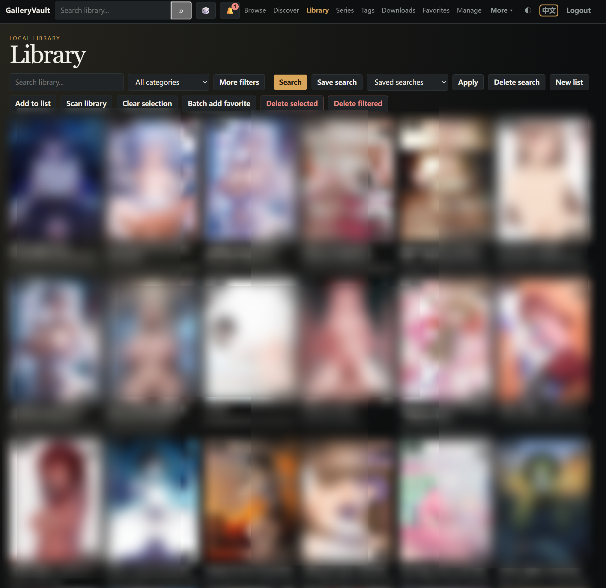
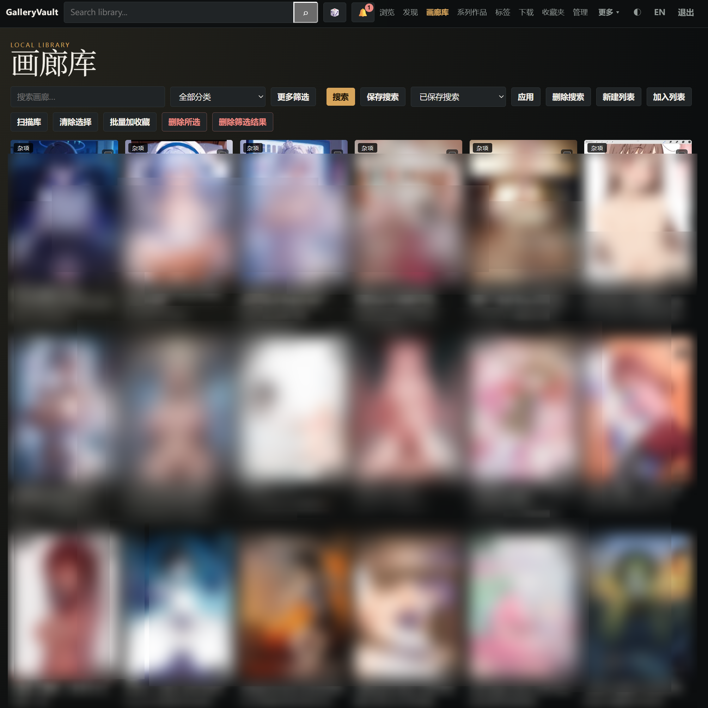
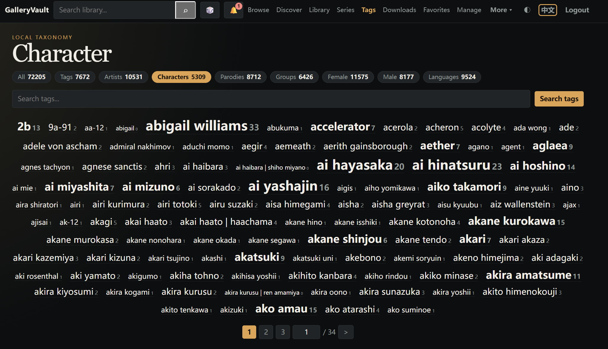
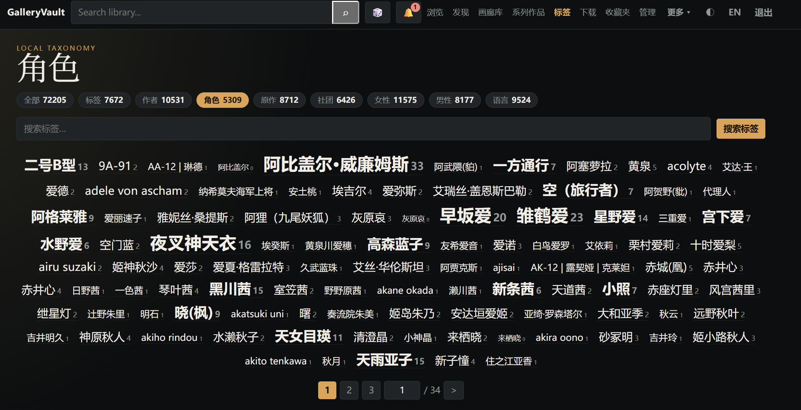
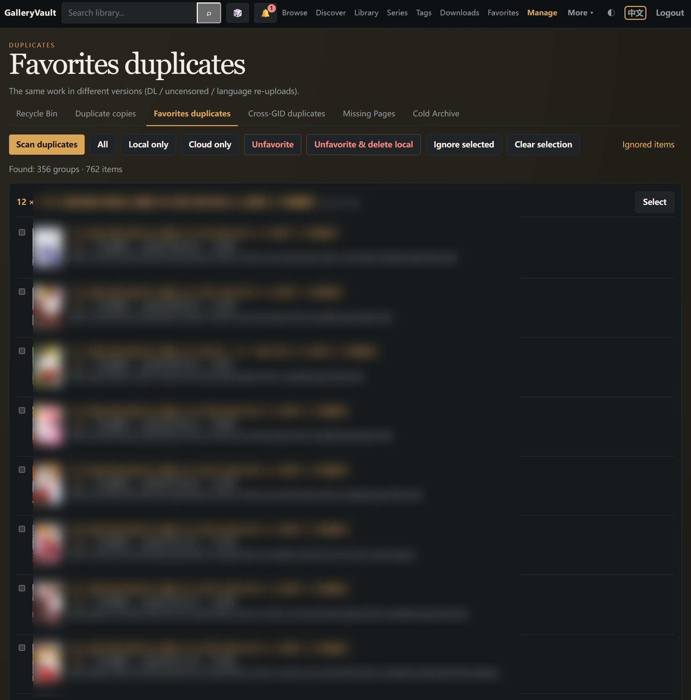
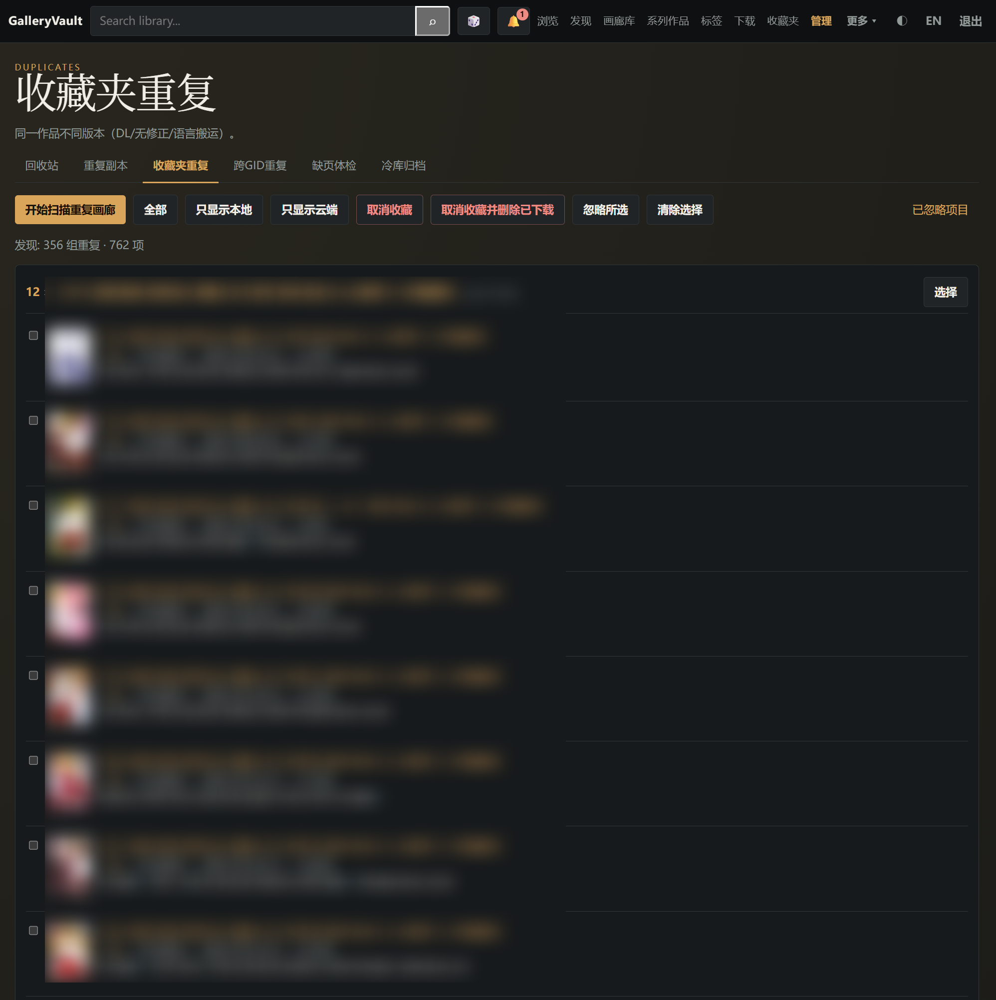

# GalleryVault

GalleryVault is a private, self-hosted library manager for local gallery archives. It indexes Ehviewer exports, CBZ/CBR archives and plain image folders into a searchable web library, and can optionally sync tags and metadata from ExHentai, download galleries, monitor favorite folders, and translate every tag. The interface is available in English and Chinese (中文).

[](https://github.com/ResidualBlood/galleryvault-backend/actions)
[](https://github.com/ResidualBlood/galleryvault-frontend/actions)
[](https://hub.docker.com/u/residualblood)
[](https://github.com/ResidualBlood/galleryvault/wiki)

[中文](README.md) · **English** · [📖 Online docs](https://github.com/ResidualBlood/galleryvault/wiki)

---

## Features

- **Local gallery library** — Scan Ehviewer export directories, CBZ/CBR files and plain image folders into a persistent, searchable index (PostgreSQL).
- **Tag cloud and search** — namespaced tags, a frequency-weighted tag cloud and
  live search suggestions; **click any tag (in the tag cloud or on the gallery
  detail page) to filter the library to every gallery carrying it**.
- **Tag translations** — Pulls the latest EhTagTranslation database; Chinese input reverse-matches the translation table (typing 巨乳 suggests `big breasts`).
- **Bilingual interface** — Full English and Chinese interface, switchable at any time; tags render their translations in the Chinese view.
- **ExHentai integration** — Use your own cookies (e-hentai.org or exhentai.org) to fetch metadata, categories and tags for every gallery.
- **Download manager** — Ehviewer-style concurrent page downloads, live progress, resumable retries (missing pages only), partial downloads (`max_pages`), cancel and bulk retry. Finished downloads are **ingested into the index immediately** (tags and cover included — no full library scan).
- **Duplicate-copy cleanup** — When the same gallery (gid) exists under several scan roots, a `duplicate_policy` (keep-first / more pages / newer / larger / smaller / manual) keeps one copy automatically and lists every other copy on a *Duplicate copies* page (thumbnail, tags, page count, size, posted date) where you can keep one or keep-and-delete the rest from disk.
- **Favorites monitor & management** — Watches the ten ExHentai favorite folders and auto-downloads missing galleries; per-folder lists, duplicate scan with ignore/restore.
- **Metadata cache & auto-sync** — Folder checks batch every favorited gallery's metadata (tags, category, posted date, size) into a database cache via the gdata API; scanned galleries reuse it with no extra fetch, and fresh metadata is applied to on-disk galleries automatically.
- **Reader and history** — Streams one page at a time with keyboard/space/click paging, preloads the next three pages, advances to the next gallery after the last page, saves your reading position.
- **Activity log page** — A single place for background tasks (scan, tag sync, thumbnails, favorites metadata) with running/finished sections and per-task cancel.
- **First-run wizard** — New deployments land in a three-step `#/welcome` guide (change password → connect ExHentai → scan the library), revisit it any time.
- **Telegram notifications** — On download success/failure, scan completion, and favorite sync; download notifications default to a **summary** digest (a bulk run collapses into one message), switchable to immediate / failures-only / off.
- **Security and privacy** — PBKDF2 auth, login rate limiting, cross-origin checks and an ExHentai domain whitelist, non-root runtime, optional **encryption at rest** (`ENCRYPTION_KEY`, AES-256-GCM); changing the password revokes every active session.
- **One-command deployment** — Two published Docker Hub images plus PostgreSQL run with a single `docker compose up`.

## Screenshots

| English UI | Chinese UI |
|------------|------------|
| **Library** | **Gallery library** |
|  |  |
| **Tag cloud** | **Tag cloud** |
|  |  |
| **Favorites dedupe** | **收藏夹查重** |
|  |  |

## Quick start

```bash
mkdir galleryvault && cd galleryvault
curl -fsSL https://raw.githubusercontent.com/ResidualBlood/galleryvault/main/docker-compose.yml -o docker-compose.yml
docker compose up -d
```

1. Open **http://\<host\>:8000** — the web UI.
2. Log in with the default password **`p1a2s3s4`** and change it in *Settings*.
3. **Recommended: configure your ExHentai cookies and run *Favorites → Check all folders* once before scanning the library** — the metadata cache makes later scanning and tag sync much faster.
4. Put your galleries in `./library` (mounted at `/library`), hit *Scan library*, and start reading.

> On first start Docker creates the `./library`, `./downloads`, `./cache` and
> `./db-data` directories automatically; the downloaded `docker-compose.yml`
> can be customized (ports, volume mounts, `ENCRYPTION_KEY`, …).

> The JSON API is available at **http://\<host\>:8001**.

## Data and volumes

| Path | Purpose |
|------|---------|
| `./db-data` | PostgreSQL data (index, settings, history) — survives container recreation |
| `./library` | **Read-only library**: your existing archives, mounted at `/library`. New downloads never land here |
| `./downloads` | **Download directory**: galleries downloaded from ExHentai, mounted at `/downloads`, scanned automatically |
| `./cache` | **Thumbnail cache** (generated), mounted at `/gv-cache` |

Library roots (read-only, one path per line) and the download root are configured separately in *Settings*; mounting other Ehviewer download folders as **scan-only libraries** is described in the [Wiki → Deployment](https://github.com/ResidualBlood/galleryvault/wiki/Deployment).

## Upgrading

```bash
docker compose pull
docker compose up -d
```

Database migrations (Alembic) run automatically when the backend starts. Images
use the `:latest` tag, so `pull` fetches new releases.

> Do **not** overwrite your local `docker-compose.yml` with
> `curl -o docker-compose.yml` — it likely contains your customizations (ports,
> volume mounts, `ENCRYPTION_KEY`, …). If you need a newer compose template,
> back it up first and merge the changes by hand.

## Security

The default password `p1a2s3s4` is for first login only — change it in Settings before exposing the instance publicly. The backend API is bound to `127.0.0.1:8001` by default; optional **encryption at rest** (`ENCRYPTION_KEY`) protects cookies / token / password hashes. The public-deployment checklist, TLS and lost-key recovery are in [Wiki → Deployment](https://github.com/ResidualBlood/galleryvault/wiki/Deployment) and [Wiki → Encryption](https://github.com/ResidualBlood/galleryvault/wiki/Encryption).

## Architecture

The project is split into two source repositories that publish the Docker images used here:

```
┌────────────┐   :8000   ┌──────────────────────┐   :8001   ┌────────────────┐
│  Browser   │ ────────▶ │ nginx SPA (vanilla JS)│ ────────▶ │ FastAPI backend │ ─▶ PostgreSQL
└────────────┘           │  /api,/login,/logout  │           └────────────────┘
                         └──────────────────────┘
```

| Component | Repository | Docker image | Host port |
|-----------|------------|--------------|-----------|
| Frontend (nginx SPA) | [galleryvault-frontend](https://github.com/ResidualBlood/galleryvault-frontend) | `residualblood/galleryvault-frontend` | **8000** |
| Backend (FastAPI + asyncpg) | [galleryvault-backend](https://github.com/ResidualBlood/galleryvault-backend) | `residualblood/galleryvault-backend` | **8001** |
| Database | — | `postgres:16-alpine` | internal |

The frontend is a dependency-free vanilla-JavaScript SPA (no build step, no CDN). The backend runs Alembic migrations automatically on boot, so upgrading is a single `docker compose pull && docker compose up -d`.

## Documentation

Full docs live on the **[📖 Wiki](https://github.com/ResidualBlood/galleryvault/wiki)**:

- [Deployment](https://github.com/ResidualBlood/galleryvault/wiki/Deployment) — compose, volumes, scan-only libraries, hardening, TLS, upgrades
- [Usage guide](https://github.com/ResidualBlood/galleryvault/wiki/Usage) — browse, reader, tags, downloads, favorites, logs, settings
- [Backup & restore](https://github.com/ResidualBlood/galleryvault/wiki/Backup)
- [Encryption at rest](https://github.com/ResidualBlood/galleryvault/wiki/Encryption) — ENCRYPTION_KEY and lost-key recovery
- [API reference](https://github.com/ResidualBlood/galleryvault/wiki/API)
- [Development](https://github.com/ResidualBlood/galleryvault/wiki/Development)
- [FAQ](https://github.com/ResidualBlood/galleryvault/wiki/FAQ)
- [Screenshots](https://github.com/ResidualBlood/galleryvault/wiki/Screenshots) — overview of the main UI pages (EN & 中文)

Product discussions & feedback: [Discussions](https://github.com/ResidualBlood/galleryvault/discussions)

## Acknowledgements

- **Ehviewer_CN_SXJ** ([github.com/xiaojieonly/Ehviewer_CN_SXJ](https://github.com/xiaojieonly/Ehviewer_CN_SXJ)) — reference for the export directory structure and naming conventions, concurrent page download and resume, and Chinese tag-translation reverse lookup.
- **EhTagTranslation** ([github.com/EhTagTranslation/Database](https://github.com/EhTagTranslation/Database)) — tag translation database and update mechanism.
- **ehsyringe** — curation and export format of the translation data.

Backend built on **FastAPI / Starlette / Uvicorn**, **SQLAlchemy / asyncpg / Alembic**, **httpx**, **Pydantic**; infrastructure is **PostgreSQL, nginx, Docker**.

## Disclaimer

ExHentai integration requires your own account cookies. Please use it responsibly and respect the site's rules and rate limits.
