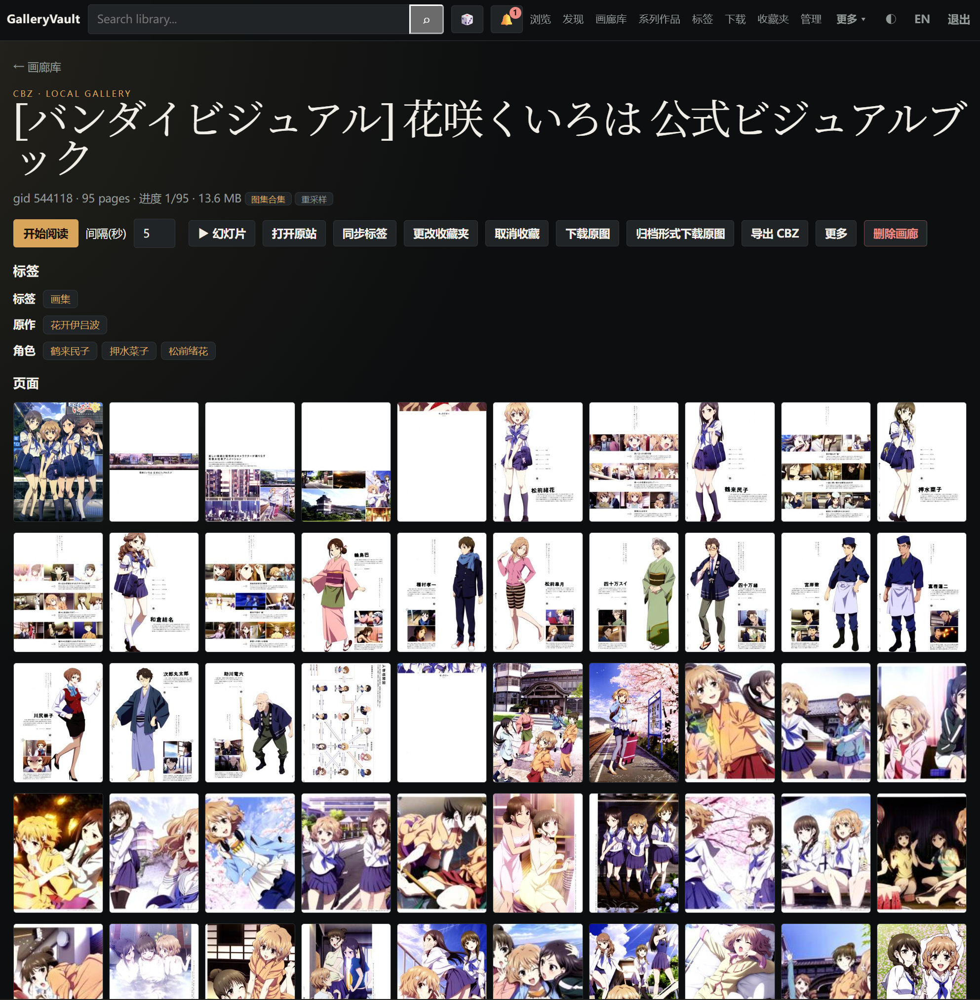

# GalleryVault

<p align="center">
  
</p>

<p align="center">
  <strong>自托管画廊库 · 为 Ehviewer 导出目录而生</strong><br>
  直接扫 <code>&lt;gid&gt;-标题/</code> 与 CBZ · 可选同步 E-Hentai / ExHentai 收藏 · 文件只留在你自己的机器上
</p>

<p align="center">
  <a href="https://github.com/ResidualBlood/galleryvault/actions/workflows/ci-backend.yml"></a>
  <a href="https://github.com/ResidualBlood/galleryvault/actions/workflows/ci-frontend.yml"></a>
  <a href="https://hub.docker.com/u/residualblood"></a>
  <a href="https://github.com/ResidualBlood/galleryvault/wiki"></a>
  <a href="https://github.com/ResidualBlood/galleryvault/blob/main/LICENSE"></a>
</p>

<p align="center">
  <strong>中文</strong> · <a href="README.en.md">English</a> · <a href="https://github.com/ResidualBlood/galleryvault/wiki">Wiki</a>
</p>

Komga / LANraragi 要你先打成压缩包；在线前端不帮你管本地资产。GalleryVault 挂上 Ehviewer 导出目录就能索引 SpiderInfo，**不配 Cookie 也能当本地库**；配了 Cookie 才逛发现页、同步十个收藏夹、下载。

## 特色

- **零改名入库** — 原生 `<gid>-标题/`、`.ehviewer`（SpiderInfo V1/V2）、JHenTai `metadata`、CBZ/CBR、7z（只抽图片）、PDF。下载写 `downloads/`，不污染 library。
- **收藏当私有云** — 十个收藏夹可增量下载或只监控；发现页 Popular / Watched / Toplist；重传换 GID 一键更新旧本。
- **库会自己收拾** — 同 GID 多副本、收藏夹重复、跨 GID（不同汉化/画质）聚类、系列成组、缺页坏图体检、多盘冷归档 CBZ。
- **阅读器按同人/漫画来** — RTL / 双页 / 条漫；幻灯片跟 GIF/WebP 帧时长。OPDS 给 Tachiyomi / Mihon；可选 Telegram Bot 粘贴 URL 入队。
- **凭证可加密落库** — `ENCRYPTION_KEY` 后 Cookie / bot token / 密码哈希走 AES-256-GCM。改密立刻吊销全部会话。

| | GalleryVault | LANraragi | e-hentai-view | Komga |
| :--- | :--- | :--- | :--- | :--- |
| 定位 | Ehviewer 资产库 + 可选 EH 同步 | CBZ 仓库 | 在线浏览前端 | 通用漫画服务器 |
| 入库 | 直接扫导出目录 | 先打成压缩包 | 不落本地库 | 规范文件夹 / 压缩包 |
| EH 深度 | 收藏监控、双通道下载、换 GID | 刮削标签 | 在线镜像 | 基本靠插件 |

<p align="center">
  
  
  
</p>

更多截图：[Wiki · 界面截图](https://github.com/ResidualBlood/galleryvault/wiki/Screenshots)。页面路由见 [入门](https://github.com/ResidualBlood/galleryvault/wiki/Usage)。

## 快速开始

```bash
mkdir galleryvault && cd galleryvault
curl -fsSL https://raw.githubusercontent.com/ResidualBlood/galleryvault/main/docker-compose.yml -o docker-compose.yml
docker compose up -d
```

1. 打开 `http://<主机IP>:8000`（API 只绑 `127.0.0.1:8001`，经前端反代）。
2. 默认密码 **`p1a2s3s4`**。登录会进 `#/welcome`，必须改密。
3. 已有画廊放到 `./library`，画廊库点 **扫描库**。新下载进 `./downloads`，不会写进 library。

### 目录

| 本地路径 | 容器内 | 说明 |
| :--- | :--- | :--- |
| `./db-data` | `/var/lib/postgresql` | PostgreSQL 18（UID 999，不要 chown 成自己。**不要用旧路径 `/var/lib/postgresql/data`，不要设 `PGDATA`**） |
| `./library` | `/library` | 已有库；下载不写这里。只读挂载时删文件会失败并记日志 |
| `./downloads` | `/downloads` | 新下载落盘并即时入库 |
| `./cache` | `/gv-cache` | 缩略图 / 封面缓存 |
| `./archive` | `/archive` | **可选**，compose 默认注释。启用后在设置填 `archive_roots`（每行一个容器路径） |

冷归档：取消注释 `- ./archive:/archive`，设置里保存 `archive_roots`，再到 **管理 → 冷库归档**（`#/archive`）打包。CBZ 名固定 `gid-英文标题.cbz`。多盘负载与清理源目录见 [部署](https://github.com/ResidualBlood/galleryvault/wiki/Deployment)。

### 环境变量

写在 `docker-compose.yml` 的 backend `environment`：

- `ENCRYPTION_KEY`：任意足够长的随机串（不是 32 字节 Hex）。设置后 Cookie / bot token / 密码哈希以 AES-256-GCM 落库。丢失则密文无法解密，见 [加密](https://github.com/ResidualBlood/galleryvault/wiki/Encryption)。
- `AUTH_SECRET`：会话签名。不填则首次启动生成并写入数据库。
- `PUID` / `PGID`：NAS 上避免下载文件属主变成 root。
- `TRUSTED_PROXIES`：反代网段，例如 `127.0.0.1,192.168.1.0/24`。
- `POSTGRES_PASSWORD`：数据库密码，默认 `galleryvault`。

路径（库根、下载根、归档根）和并发只在 Web 设置里改。连接池等调优见 [部署](https://github.com/ResidualBlood/galleryvault/wiki/Deployment)。

## 文档

- [入门](https://github.com/ResidualBlood/galleryvault/wiki/Usage) — 向导、Cookie、顶栏
- [功能](https://github.com/ResidualBlood/galleryvault/wiki/Features) — 能力矩阵
- [部署](https://github.com/ResidualBlood/galleryvault/wiki/Deployment) — 挂载、Nginx/Caddy、冷热存储
- [库维护](https://github.com/ResidualBlood/galleryvault/wiki/Manage) — 查重、缺页、冷归档
- [FAQ](https://github.com/ResidualBlood/galleryvault/wiki/FAQ)

Ehviewer 家族、JHenTai、OPDS：[Compatibility](https://github.com/ResidualBlood/galleryvault/wiki/Compatibility)。

## 致谢

- Ehviewer_CN_SXJ — 目录与 SpiderInfo 约定
- EhTagTranslation — 标签词库
- ehsyringe — 翻译数据整理

## 免责声明

### 1. NSFW / 18+

本软件供个人在私有设备上整理媒体。可能被用来存放成人内容。**仅供达到法定成年年龄者使用**。未满法定年龄或当地法律禁止的，请停止使用。

### 2. 第三方内容

GalleryVault **不托管、不分发**任何媒体文件。连 E-Hentai / ExHentai 需要你自己的 Cookie。检索、下载、存储的法律责任由使用者自行承担。
